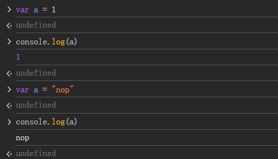

# js数据类型
## 基本数据类型
- number
- string
- boolean
- undefined
- null
- symbol
- bigint

## 引用数据类型
- object

## typeof
- number
- string
- boolean
- undefined
- object
- function
- symbol
- bigint

## instanceof
- 判断一个对象是否是某个构造函数的实例
## 动态数据类型

## js数组
var car = new Array();
car[0]="Saab";
car[1]="Volvo";
car[2]="BMW";
或者
var car = ["Saab","Volvo","BMW"];
## js对象
var person = {firstName:"John", lastName:"Doe", age:50, eyeColor:"blue"};
或者
var person = {
    firstName:"John",
    lastName:"Doe",
    age:50,
    eyeColor:"blue"
};
## js对象寻址
name=person.lastName;
name=person["lastName"];
